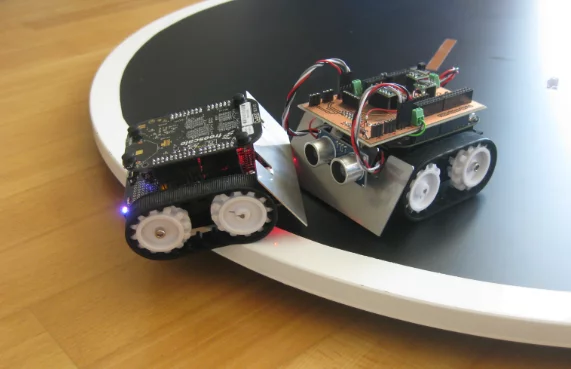

## **Robô da Categoria Sumô para TJR**

### **Objetivo:**

Desenvolver um robô autônomo dentro das normas da competição para derrubar o adversário do ringue.

> **Obs.1:** Todo o desenvolvimento deve ter em mente as limitações da competição, como peso e tamanho.
> 

> **Obs.2:** Todas as etapas do desenvolvimento deverão ser detalhadas no relatório com modelo a ser enviado. Mais importante que desenvolver é como vocês desenvolveram.
> 

## **Materiais necessários:**

1. Microcontrolador (Exemplos: Arduino, ESP...)
2. Sensor(es) Ultrassônico(s)
3. Sensores Ópticos Reflexivos
4. Motores DC com Roda de Tração
5. Ponte H (Circuito de Acionamento de Motores)
6. Bateria (Alimentação)
7. Placa de Prototipagem (Opções: Protoboard, Placa Perfurada ou PCI)
8. Conjunto de Fios e Cabos

## **Atividades:**

1. **Planejamento Inicial:** Inicialmente, analisar atentamente o edital da competição com o objetivo de compreender todas as suas exigências.
    1. Criar um resumo conciso das principais exigências estabelecidas no edital.
    2. Realizar uma análise detalhada dos materiais e robôs já existentes na RAS UFCG (ou em outras fontes relevantes), a fim de:
        1. Listar os componentes e recursos atualmente disponíveis.
        2. Identificar os itens faltantes ou que precisam de aprimoramento para atender às especificações da competição.
        3. Propor modificações ou melhorias nos designs existentes.
2. **Seleção de Componentes:** Selecionar e adquirir os componentes eletrônicos e mecânicos necessários, baseando-se em uma lista de materiais previamente elaborada e considerando a disponibilidade desses componentes no laboratório.
3. **Estudo de Sensores e Atuadores:**
    1. Realizar estudos iniciais sobre sensores, com foco em sensores ultrassônicos e ópticos, para compreender seus princípios de funcionamento.
    2. Estudar o funcionamento de atuadores, especificamente motores DC, a fim de entender como eles podem ser controlados para a movimentação do robô.
4. **Programação e Microcontrolador:** Investigar a placa de prototipagem Arduino, compreendendo como funciona sua programação, abordando os seguintes tópicos:
    1. Configuração dos pinos, conhecidos como Pinos Gerais de Entrada e Saída (GPIO).
    2. Leitura e escrita digital.
    3. Leitura analógica.
    4. Modulação por largura de pulso (PWM).
    5. Utilização de funções temporizadoras, como delay() e millis().
    6. Tratamento de interrupções.
5. **Sensores Ópticos Reflexivos: Estudar sensores ópticos reflexivos, em particular o TCRT5000, que desempenha um papel crucial na detecção da borda do ringue, considerando:**
    1. O princípio de funcionamento desses sensores.
    2. Dimensionamento dos resistores para o Diodo Emissor de Luz (LED) Infravermelho (IR) e o fototransistor.
    3. Processo de leitura dos sinais analógicos no Arduino.
    4. Técnicas de filtragem dos sinais da leitura.
    5. Estratégias para detectar a faixa da borda do ringue, como posicionamento, quantidade etc.
6. **Sensor de Distância:** Estudar sensores de distância, em particular, o HC-SR04, que desempenha um papel crucial na detecção do adversário, considerando:
    1. O princípio de funcionamento desses sensores.
    2. Conexões e interface.
    3. Processo de cálculo de distância por meio da leitura.
    4. Técnicas de filtragem dos sinais da leitura.
    5. Estratégias para detectar o adversário no ringue, como posicionamento, quantidade etc.
7. **Circuitos de Acionamento de Motores DC:** Compreender o funcionamento dos circuitos de acionamento de motores DC, como a Ponte H, para garantir que o microcontrolador possa controlar eficazmente os motores.
    1. Explorar os princípios subjacentes a esses circuitos.
    2. Aprender a utilizar os módulos disponíveis no laboratório, como L298N e CI L293D.
8. **Sistema de Alimentação:** Desenvolver um sistema de alimentação elétrica eficiente, considerando a capacidade da bateria, o valor de tensão e corrente necessários para o circuito e a seleção adequada do tipo de bateria.
9. **Design Mecânico:** Construir o chassi do robô de acordo com as restrições de peso e dimensões da competição, acomodando todos os componentes eletrônicos de forma adequada.
    1. Considerar a possibilidade de propor um novo modelo ou adaptar um já existente.
    2. Criar um desenho detalhado usando ferramentas CAD, revisando as conexões e fazendo modificações conforme necessário.
10. **Prototipagem e Testes:** Implementar um protótipo funcional da estrutura e dos circuitos do robô, realizando testes práticos para verificar o desempenho do robô sob condições reais, ajustando os parâmetros do código conforme necessário.
    1. Testar a eficácia dos sensores ultrassônicos e da detecção da faixa pelo TCRT5000.
    2. Controlar os motores para seguir um objeto a uma distância de 5 centímetros.
11. **Estratégias de Combate:**
    1. Estudar estratégias específicas para robôs de sumô, determinando a melhor abordagem para o tipo de robô desenvolvido.
    2. Analisar estratégias mecânicas para melhorar o desempenho do robô, considerando fatores como a otimização do atrito, o formato dos pneus e o design da rampa.
12. **Documentação e Relatório:** Documentar cuidadosamente todo o processo de desenvolvimento em um relatório abrangente, incluindo diagramas, esquemas elétricos, código-fonte, resultados de testes e lições aprendidas ao longo do caminho.

## **Material de apoio:**

1. [Regras Sumô TJR](https://github.com/ras-ufcg/TJR-Sumo/blob/main/docs/MANUAL%20DE%20ARBITRAGEM%20SUMÔ%202020.pdf)
2. [Regras de robô de sumô SBC](http://erbase.sbc.org.br/2017/Documentos/RRC_regras_Sum%C3%B4_de_robos.pdf)
3. [Como funciona um sensor ultrassônico?](https://tipotemporario.com.br/elektra/blog/voce-sabe-o-que-e-e-como-funciona-o-sensor-ultrassonico/)
4. [Como funciona um sensor óptico?](https://djpautomacao.com/sensores-opticos/)
5. [YouTube - Aprenda programar o Arduino com Tinkercad - Curso para iniciantes](https://www.youtube.com/watch?v=3c8mXZUHCQY)
6. [YouTube - Curso de Arduino](https://www.youtube.com/watch?v=rCILKZPG0Kg&list=PL7CjOZ3q8fMc3OmT7gD7N6sLLFfXsXGZi)
7. [Arduino - Uno R3](https://docs.arduino.cc/hardware/uno-rev3)
8. [Arduino - Documentação da Linguagem](https://www.arduino.cc/reference/en/?_gl=1*1tibx12*_ga*MTczMDYwMDE5My4xNjkzNzY5MzEy*_ga_NEXN8H46L5*MTY5NjY3OTI3My4xMi4xLjE2OTY2NzkzNTguMC4wLjA.)
9. [10 maneiras de destruir um arduino](https://www.rugged-circuits.com/10-ways-to-destroy-an-arduino/)
10. [Como utilizar millis?](https://www.seeedstudio.com/blog/2021/05/11/multitasking-with-arduino-millis-rtos-more/#:~:text=To%20do%20this%2C%20the%20millis,)
11. [Sensor Óptico TCRT5000 com Arduino](https://blog.eletrogate.com/sensor-optico-tcrt5000-com-arduino/)
12. [Como utilizar o sensor HC-sr04?](https://www.sta-eletronica.com.br/artigos/arduinos/sensor-ultrassonico-hc-sr04#:~:text=O%20som%20viaja%20pelo%20ar,velocidade%20do%20som%20no%20ar.)
13. [Tutorial - Ultrassônico](https://www.filipeflop.com/blog/sensor-ultrassonico-hc-sr04-ao-arduino/)
14. [Como funciona uma ponte H?](https://www.manualdaeletronica.com.br/ponte-h-o-que-e-como-funciona/)
15. [Controlando Motor de Vidro Elétrico de Carro pelo Arduino usando L298N](https://www.youtube.com/watch?v=Y-QEB1PMAYU)
16. [Controle de Velocidade de um Motor de Vidro Elétrico com Arduino e IBT2](https://www.youtube.com/watch?v=TU_weui9BoA)

## Exemplos de Projetos Sumô

1. [Exemplo - Sumo Robot - GitHub YohanAlexander](https://github.com/YohanAlexander/sumo-robot)
2. [Aprimoramento de um Robô Lutador de Sumô Autônomo - TCC Kallil Miguel Caparroz Zielinski](https://repositorio.utfpr.edu.br/jspui/handle/1/14620)
